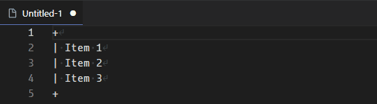
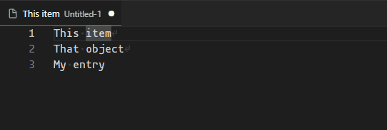
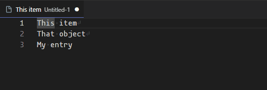

# Pad to Column
**Pad to Column** is a Visual Studio Code extension that allows you to pad a line with a given character(s) up to a certain column.

## Features
This extension makes it easier to pad a line with any desired characters. For example, you can simplify making text tables:

You can also add padding at different places in each line:

*Note that only the first selection in a line will be padded.*

## Extension Settings
This extension contributes the following settings:

* `padToColumn.defaultCharacters`: Default characters to pad with using the `Pad lines with default values` command.
* `padToColumn.defaultColumn`: Default column to pad to using the `Pad lines with default values` command.
